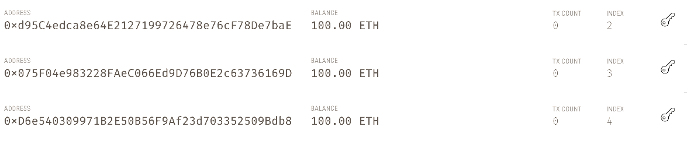
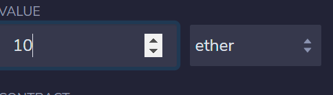
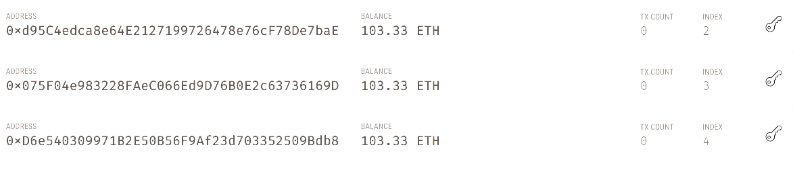

# Solidity Smart Contracts

The associate profit splitter takes any deposit and distributes it evenly among the three addresses
in which the contract was deployed with

This image demonstrates the starting amounts for the three addresses to which the deposit was made

This shows the amount of ether being distributed

The final product thanks to the smart contract